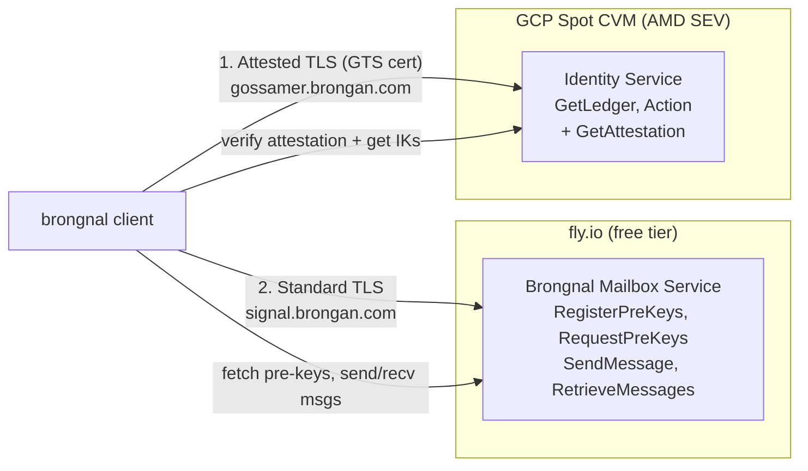
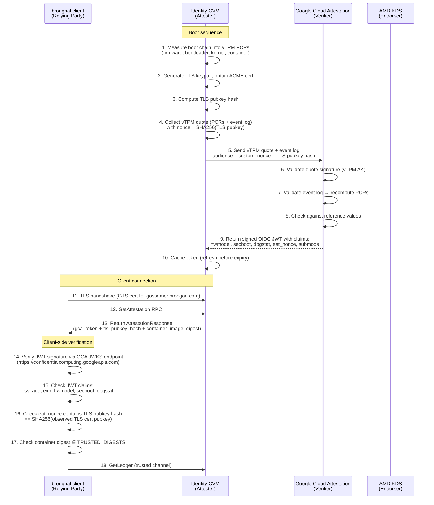

# Confidential Computing Backend for Brongnal

## Threat Model

### What We're Protecting

The **only** trust-critical operation is `GetLedger` — resolving a username to its Ed25519 identity key(s). This is the sole point where a malicious server can enable a MITM attack.

### Why GetLedger Is the Sole Vulnerability

**`GetLedger` (Gossamer):** The client calls this to resolve a username (e.g., "alice") to Ed25519 identity keys (IKs). If the server returns attacker-controlled IKs, the sender will fetch pre-keys for those attacker IKs, establish an X3DH session with the attacker, and encrypt messages to the attacker.

**`RequestPreKeys` is NOT vulnerable:** The pre-key bundle contains a `SignedPreKey` whose signature is verified against the recipient's identity key in [`initiate_send_get_sk`](file:///home/brong/ws/brongnal/native/protocol/src/x3dh.rs#L148-L153):
```rust
verify_bundle(&recipient_ik, &[spk.pre_key], &spk.signature)
    .map_err(|_| X3DHError::SignatureValidation)?;
```
If the server substitutes attacker-controlled pre-keys, the signature validation fails because the pre-keys won't be signed by the legitimate identity key. The server can only serve pre-keys that were actually signed by the identity key's holder.

**Message receipt validation:** On the receiving side, [`MessageSubscriber`](file:///home/brong/ws/brongnal/native/client/src/lib.rs#L189-L192) validates the sender's claimed username against the ledger:
```rust
if !self.ledger.validate_username(&ratchet_message.message.sender, &message.ik) {
    warn!("Message failed username validation...");
    continue;
}
```

### Attack Chain

The only viable attack requires controlling `GetLedger`:
```
1. Alice calls GetLedger("bob") → server returns attacker IK instead of Bob's IK
2. Alice calls RequestPreKeys(attacker_IK) → server returns attacker's pre-keys
3. verify_bundle(attacker_IK, attacker_SPK, attacker_sig) → passes ✅ (attacker signed their own keys)
4. Alice encrypts message to attacker → attacker decrypts, re-encrypts to real Bob, forwards
```

Step 1 is the critical vulnerability. Steps 2-4 follow naturally because the pre-keys are correctly signed by the (wrong) identity key.

### What Is NOT a Vulnerability

| Claimed vulnerability | Why it's not |
|---|---|
| "SQLite unencrypted at rest" | The database contains `username → identity key` mappings, which are **public data**. Reading them is not a confidentiality breach. The risk is **modification** (editing the mapping), not **disclosure**. |
| "No attestation of OS/firmware" | Only relevant because the server binary is currently trusted to return correct mappings. If the client could independently verify mappings (via Gossamer transparency or attestation), OS integrity would be less critical. |
| "Pre-key substitution" | Pre-keys are signed by the identity key. The client validates the signature before proceeding with X3DH. |
| "OPK rollback" | Clients are expected to locally burn one-time pre-keys to prevent reuse. A disk rollback that resurrects OPKs is handled client-side. |

### Actual Risks

| Risk | Severity | Mitigation |
|---|---|---|
| **GetLedger returns wrong IK** | **Critical** — enables full MITM | Attestation (this proposal) |
| **Server denies service** | Medium — messages can't be sent | Out of scope for CC; operational concern |
| **Username→IK mapping modified on disk** | High — enables wrong IK on restart | See disk modification analysis below |
| **Username→IK mapping rolled back** | Low — reverts key revocations or new registrations | Accepted risk for Phase 1 |

### Disk Modification Mitigation (In Depth)

The identity service stores username→IK mappings on an encrypted Hyperdisk. A malicious operator who can modify the disk contents could alter mappings to redirect messages. Protection comes from two layered mechanisms:

**Layer 1: CMEK encryption ties the disk to the GCP project.** The Hyperdisk is encrypted with a Customer-Managed Encryption Key (CMEK) in Cloud KMS. The Compute Engine service agent decrypts disk blocks transparently. An attacker who steals a raw disk snapshot cannot decrypt it without access to the KMS key. However, this does NOT prevent a GCP-privileged operator from modifying disk contents through the Compute Engine API (they have implicit access to the CMEK via the service agent).

**Layer 2: Attestation proves which binary reads the disk.** The attested container binary is the only code that interprets the SQLite database. Even if an attacker modifies raw disk bytes:
- The SQLite database has internal consistency checks (header, page checksums) — random byte changes will corrupt the database, causing the attested binary to return errors rather than wrong data
- Targeted SQLite modifications require understanding the schema and page layout — this is possible but requires significant effort
- The attestation guarantees the binary hasn't been modified to bypass its own validation logic

**Layer 3 (future): Application-level integrity.** In Phase 2, the Gossamer transparency log will provide a Merkle root over all mappings. The attested binary computes and exposes this root. Clients can verify the root against the transparency log, making any disk modification detectable.

**Residual risk:** A GCP operator with Compute Engine access could theoretically modify disk contents in a way that produces valid SQLite data with altered mappings, and the attested binary would serve it. This requires: (1) deep knowledge of the SQLite schema, (2) modifying the disk while the VM is stopped (live modification is prevented by SEV memory encryption), (3) the binary not validating internal consistency beyond SQLite's own checks. This is a narrow, high-skill attack that is accepted for Phase 1 and mitigated by the transparency log in Phase 2.

---

## Split Architecture

### Insight: Only `GetLedger` Needs Attestation

Since `RequestPreKeys` responses are signature-validated and messages are E2EE'd, the mailbox service doesn't need to be trusted for correctness. Only the identity service (`GetLedger`, `Action`) needs the confidential computing protection.

### Architecture



| Service | Where | Cost | Trust model |
|---|---|---|---|
| **Identity Service** (Gossamer) | GCP Spot CVM, AMD SEV | ~$20-25/mo | Attested: client verifies GCA OIDC JWT + aTLS binding |
| **Mailbox Service** (Brongnal) | fly.io free tier | $0 | Untrusted: pre-keys are signature-validated, messages are E2EE |

### Why This Is Safe

1. Client connects to Identity Service first, verifies attestation, fetches `GetLedger` → trusted IKs
2. Client connects to Mailbox Service, fetches `RequestPreKeys(trusted_IK)` → pre-keys are validated against the trusted IK's signature
3. Client encrypts message to the trusted IK → only the real recipient can decrypt
4. Even if fly.io is fully compromised, it can only cause a **Malicious Outage (MalOut)**:
   - **Drop messages** — denial of service
   - **Serve wrong pre-keys** — rejected by signature validation against the trusted IK
   - **Read ciphertext** — useless without the recipient's private key
   - **Refuse to deliver messages** — denial of service
   - A MalOut is annoying but **not a confidentiality or integrity breach**

> [!NOTE]
> **Long-term improvement:** The fly.io mailbox currently accepts `RegisterPreKeyBundle` for any identity key without validating it's registered in the identity service. This means orphaned pre-keys can accumulate for unregistered IKs. This is not a security issue (pre-keys are signature-validated) but is a cleanliness concern to be tracked as a future improvement.

---

## Confidential Computing vs. Key Transparency (Gossamer)

### High-Level Comparison

| | Confidential Computing | Key Transparency (Gossamer) |
|---|---|---|
| **Guarantees** | Prevents MITM in real-time | Detects MITM after the fact |
| **Trust basis** | AMD hardware + Google vTPM + GCA | Auditor consensus |
| **Infrastructure** | GCP CVM (~$20-25/mo Spot) | Witness servers (must be run by independent parties) |
| **Client complexity** | Verify GCA OIDC JWT + aTLS binding | Download/verify Merkle tree proofs |
| **Hardware requirements** | AMD EPYC + SEV/SNP | None |
| **Vendor lock-in** | GCP-specific | Infrastructure-agnostic |
| **Cost** | ~$20-25/mo | Cost of witness infrastructure (who pays?) |
| **Scalability** | Single server, OIDC token cached | Merkle tree efficiency scales well |

### Gossamer Bandwidth Analysis

The Gossamer model requires clients to download and verify the directory tree. Cost at different scales:

| Users | Ledger size (raw) | Merkle proof size | Full tree download | Mobile impact |
|---|---|---|---|---|
| 100 | ~6 KB (100 × 64B entries) | ~0.5 KB per lookup | 6 KB per sync | Negligible |
| 10,000 | ~625 KB | ~0.9 KB per lookup | 625 KB per sync | Acceptable |
| 1,000,000 | ~62 MB | ~1.3 KB per lookup | 62 MB per sync | Full download impractical; need inclusion proofs |

At current scale (~2 users), either approach works. At 10K+ users, Gossamer needs inclusion proofs (prove a specific key is in the tree without downloading the full tree). At 1M+, prefix trees become useful for efficient range queries.

### Why Prefix Trees Aren't Needed Now

The current design hashes usernames with Blake2b before storing:
```rust
let provider = Blake2b::<typenum::U32>::digest(name.as_bytes()).to_vec();
```
Plaintext usernames are never stored or revealed. Dictionary attacks are possible but:
- GDPR/Play Store concerns are avoided
- At current scale (<100 users), a simple sorted list or flat Merkle tree suffices
- Prefix trees (CONIKS-style) add complexity for privacy properties that are already handled by hashing

### Phase Recommendation

**Phase 1** (this proposal): Confidential Computing. Immediate protection, simpler client logic, works today.

**Phase 2** (future): Gossamer transparency layered on top. The attested binary commits key updates to a transparency log. Defense in depth.

---

## Google Cloud Attestation (GCA) — Background Check Model

> [!IMPORTANT]
> We use GCA in the **background check model** per the [RATS architecture](https://datatracker.ietf.org/doc/rfc9334/). This is a critical design choice that determines the entire attestation data flow. See [GCA attestation overview](https://docs.cloud.google.com/confidential-computing/confidential-vm/docs/attestation-overview#background-check-model).

### What Is GCA?

[Google Cloud Attestation](https://docs.cloud.google.com/confidential-computing/docs/attestation) is a unified service for verifying the trustworthiness of Google confidential environments. It:
1. Accepts raw vTPM evidence (quotes + event logs) from a Confidential VM
2. Internally validates the evidence against hardware vendor endorsements (AMD) and Google-maintained reference values
3. Returns a signed **OIDC JWT** (an [Entity Attestation Token](https://datatracker.ietf.org/doc/draft-ietf-rats-eat/)) containing verified claims about the CVM's state

### Two RATS Attestation Models

The [RATS RFC 9334](https://datatracker.ietf.org/doc/rfc9334/) defines two attestation models. GCA supports both, and we use the **background check model**:

| | Passport Model | Background Check Model (ours) |
|---|---|---|
| **Flow** | Attester → Verifier → Attester → Relying Party | Attester → Relying Party → Verifier → Relying Party |
| **Who talks to verifier?** | The attester (CVM) | The relying party (client) |
| **Who holds the token?** | The attester passes it to the relying party | The relying party obtains it directly |
| **Typical GCP use** | Confidential Space | Our custom integration |

> [!NOTE]
> **Why background check, not passport?** In the passport model, the CVM obtains an OIDC token from GCA and serves it to the client. The client must trust that the CVM freshly obtained this token and didn't replay a stale one. In the background check model, the client receives raw evidence (vTPM quote) from the CVM, forwards it to GCA itself, and gets back a freshly-signed token. This eliminates token replay concerns because the client controls the verification timing. However, since our CVM already serves the token from a `GetAttestation` RPC, and the token has short-lived `exp`/`nbf` timestamps, either model would work. We use **a hybrid approach**: the CVM pre-fetches the GCA token (passport-style) for efficiency, but embeds a client-verifiable nonce (`eat_nonce`) containing the TLS public key hash to bind the token to the active TLS session.

### Our Specific Flow (Hybrid Background Check)



### What the GCA OIDC Token Contains

The [GCA token](https://docs.cloud.google.com/confidential-computing/confidential-vm/docs/token-claims) is a standard JWT signed by Google, with claims including:

| Claim | Our usage |
|---|---|
| `iss` | Must be `https://confidentialcomputing.googleapis.com` |
| `aud` | Custom audience we set when requesting the token |
| `exp`/`nbf`/`iat` | Token freshness — reject if expired |
| `hwmodel` | Must be `GCP_AMD_SEV` (confirms CVM hardware) |
| `secboot` | Must be `true` (Secure Boot was enabled) |
| `dbgstat` | Must be `disabled-since-boot` (no debug access) |
| `eat_nonce` | Contains our TLS pubkey hash for aTLS binding |
| `submods.gce.project_id` | Can optionally validate the GCP project |
| `submods.gce.instance_name` | Can optionally validate the instance name |
| `swname` | `GCE` — confirms running on Compute Engine |

### What the Client Does NOT Do

The client **does not**:
- Parse raw vTPM quotes
- Validate vTPM attestation key certificate chains
- Interact with AMD KDS
- Recompute PCR values from event logs
- Run any `go-tpm-tools` code

All of that is done by GCA. The client only verifies a standard OIDC JWT.

### Why This Simplifies the Client

| Raw vTPM verification (NOT our approach) | GCA OIDC verification (our approach) |
|---|---|
| Client must parse TPM2 quote structures | Client verifies a standard JWT |
| Client validates Google Shielded VM CA → EK → AK chain | Client fetches JWKS from `googleapis.com` |
| Client recomputes PCR values from event log | GCA handles PCR validation internally |
| Client needs `tss-esapi` or equivalent TPM library | Client needs `jsonwebtoken` crate |
| Client needs AMD root cert for SNP validation | Not needed — GCA checks hardware endorsements |
| ~500+ lines of verification code | ~50 lines of JWT verification code |

---

## Detailed Trust Model

### Trust Chain (AMD SEV + GCA Background Check)

| What | Who you trust | Why |
|---|---|---|
| Memory encryption | AMD SEV silicon | Hardware encrypts VM memory |
| Firmware/OS integrity | Google vTPM + Secure/Measured Boot | Google's vTPM records boot measurements into PCRs |
| Container integrity | Launcher extends vTPM PCR[14] | Launcher computes container hash and extends PCR |
| vTPM evidence collection | `go-tpm-tools` on CVM | Collects quote + event log from `/dev/tpmrm0` |
| Evidence verification | Google Cloud Attestation (GCA) | Google's attestation service validates vTPM evidence against reference values and produces a signed JWT |
| JWT signature | GCA signing key | Token signed by key discoverable at `https://confidentialcomputing.googleapis.com/.well-known/openid-configuration` → JWKS |
| Boot state claims | GCA token claims | `hwmodel`, `secboot`, `dbgstat` reflect verified boot state |
| Container digest | Hardcoded in client | Client checks `container_image_digest` ∈ `TRUSTED_DIGESTS` (built reproducibly from Nix flake) |
| TLS transport | CVM-terminated TLS, aTLS binding | TLS cert pubkey hash embedded in `eat_nonce` of GCA token |
| TLS certificate | GTS Public CA (ACME) | Publicly trusted cert; CA cannot forge attestation |

> [!NOTE]
> **Why only one row for Firmware/OS integrity?** With AMD SEV (non-SNP), there is no hardware launch measurement from the AMD Secure Processor. All attestation goes through Google's vTPM. The `gs://gce_tcb_integrity/` firmware endorsements are only relevant for SEV-SNP, where the AMD Secure Processor produces a hardware-rooted launch measurement that can be cross-referenced with Google's published firmware hashes. If/when we upgrade to SEV-SNP, a second trust path (AMD hardware → launch measurement) is added.

### vTPM PCR Measurements

| PCR | What is measured | Boot stage |
|---|---|---|
| PCR[0] | UEFI firmware (OVMF) code | Firmware |
| PCR[1] | UEFI firmware configuration | Firmware |
| PCR[4] | Boot manager code (GRUB/systemd-boot) | Bootloader |
| PCR[5] | Boot manager configuration (GPT table) | Bootloader |
| PCR[7] | Secure Boot policy (db, dbx, KEK, PK) | Secure Boot |
| PCR[9] | Kernel image + initrd | OS boot |
| PCR[14] | **Container image digest** (extended by launcher) | Application |

> [!NOTE]
> **PCRs are verified by GCA, not by the client.** The client never sees raw PCR values. GCA validates the vTPM quote (which covers all PCRs) and reports the results as claims in the OIDC token. PCR[14] containing the container digest is how GCA can confirm what container is running, but this information enters the client's trust model via the `container_image_digest` field in our `AttestationResponse` proto (which the launcher populates from its own measurement), cross-checked against the GCA token's attestation that the boot chain is valid.

### vTPM Trust Analysis

The vTPM is a **Google-managed software component**, not an independent hardware chip:

| Aspect | Implication |
|---|---|
| Google implements the vTPM | You trust Google's code to honestly record measurements |
| vTPM endorsement keys are Google-generated | Google could theoretically forge quotes |
| GCA validates vTPM quotes | You trust Google's attestation service to honestly evaluate evidence |
| With SEV: vTPM + GCA are the **only** attestation root | Full trust in Google for attestation integrity |
| With SEV-SNP: vTPM is supplementary | AMD hardware provides independent root; vTPM adds OS-level detail |
| Improvement vs. fly.io | On fly.io, you trust fly.io for **everything** — binary integrity, TLS, data. On GCP SEV + GCA, you trust Google's vTPM + GCA (production-hardened) but get real memory encryption |

---

## CMEK (Customer-Managed Encryption Keys)

CMEK lets you manage your own encryption keys in Cloud KMS for the identity service's Hyperdisk.

**What it protects:** Unauthorized read access to raw disk data by anyone who doesn't have the KMS key.

**What it does NOT protect:** Modification of disk data by the cloud operator (who controls the infrastructure), or rollback attacks.

**For the identity service,** CMEK is a defense-in-depth measure. The username→key mapping data is not confidential (it's public), so disk encryption primarily protects against physical disk theft at the data center. The real protection comes from attestation proving which binary runs.

**Rollback protection:** Accepted as a known risk for Phase 1. The identity service's Gossamer state could be rolled back to revert a key revocation or new registration. Application-level epoch counters will be added in Phase 2 alongside Gossamer transparency work.

---

## TLS: CVM-Terminated with GTS Public CA

### Architecture

```
Client ──TLS (443)──► Identity CVM (public IP, GTS cert, TLS in encrypted memory)
```

The CVM terminates TLS directly. No load balancer, no proxy. The TLS private key exists only in SEV-encrypted memory.

### ACME Implementation

The launcher uses the **`instant-acme`** Rust crate (lightweight, async ACME client) to obtain a GTS certificate:

1. **EAB (External Account Binding):** A one-time registration that links the ACME account to the GCP project. `gcloud publicca external-account-keys create` generates a `keyId` + `b64MacKey` pair. These are stored in the CVM's **instance metadata** (`/computeMetadata/v1/instance/attributes/eab-kid` and `eab-hmac`). They're used only once during initial ACME account registration; after that, the ACME account key is used.
2. **DNS-01 challenge:** The launcher adds a `_acme-challenge.gossamer.brongan.com` TXT record via the Cloud DNS API. **No additional inbound ports needed.** Only outbound HTTPS to `dv.acme-v02.api.pki.goog` and `dns.googleapis.com`.
3. **Certificate lifecycle:** 90-day cert, auto-renewed by the launcher 30 days before expiry.

| Aspect | Details |
|---|---|
| ACME client | `instant-acme` Rust crate (in launcher) |
| CA | GTS Public CA (`dv.acme-v02.api.pki.goog/directory`) |
| Challenge | DNS-01 via Cloud DNS API (no extra ports) |
| EAB storage | GCP instance metadata (not sensitive after registration) |
| Cert storage | `/run/tls/` (tmpfs, in encrypted memory) |
| Firewall | **Only TCP 443 inbound**, no port 80 or ACME ports |

### Attested TLS (aTLS) Binding

1. CVM generates TLS keypair at boot (in encrypted memory)
2. ACME client obtains GTS cert for `gossamer.brongan.com` via DNS-01
3. Launcher computes `SHA-256(TLS cert public key)` = TLS pubkey hash
4. Launcher requests GCA token with `eat_nonce` = TLS pubkey hash
5. GCA token embeds the nonce, so the signed JWT attests the TLS pubkey
6. Client verifies: `eat_nonce in JWT == SHA-256(observed TLS cert pubkey from handshake)`
7. This proves: **the TLS endpoint is the attested CVM**

### Why GTS over Let's Encrypt

Both are free ACME CAs with identical security properties. Both are widely trusted CAs subject to the same CA/Browser Forum policies. The choice is purely operational convenience: GTS EAB integrates with `gcloud`, DNS-01 uses the same Cloud DNS zone already managed in the GCP project. Neither CA choice affects the attestation security model.

---

## Attestation Verification: Part of Channel Construction

### Design Decision: Not a Separate RPC

`GetAttestation` is **not** a user-facing RPC. It is called automatically during **gRPC channel construction**. The flow:

```rust
// Client code
let identity_channel = AttestatedChannel::connect(
    "https://gossamer.brongan.com",
    TRUSTED_SERVER_DIGESTS,
).await?;  // ← attestation verified here, connection fails if invalid

let gossamer = GossamerServiceClient::new(identity_channel);
let ledger = gossamer.get_ledger(...).await?;  // ← already attested
```

### Channel Lifecycle

1. **Connect:** Client opens TLS connection to `gossamer.brongan.com:443`
2. **Attest:** Immediately calls `GetAttestation` RPC, receives `AttestationResponse` containing the GCA OIDC token
3. **Verify JWT:** Client validates the GCA token signature via the [GCA JWKS endpoint](https://www.googleapis.com/service_accounts/v1/metadata/jwk/signer@confidentialspace-sign.iam.gserviceaccount.com)
4. **Check claims:** Client verifies `iss`, `aud`, `exp`, `hwmodel`, `secboot`, `dbgstat`
5. **Check aTLS:** Client verifies `eat_nonce` matches `SHA-256(observed TLS cert pubkey)`
6. **Check container:** Client verifies `container_image_digest` ∈ `TRUSTED_DIGESTS`
7. **Hold open:** gRPC channel stays open for all subsequent `GetLedger`/`Action` calls
8. **Re-verify on reconnect:** If the channel drops and reconnects, attestation is re-verified

### Why Not Per-Request?

Attestation involves a JWT verification and JWKS fetch. Doing it once per channel is sufficient because:
- The aTLS binding guarantees the channel endpoint is the attested CVM for its entire lifetime
- The TLS session prevents injection or modification after attestation
- If the CVM restarts (new container), the TLS connection drops and re-attestation happens automatically

---

## COS Hardening Plan

### Default COS State

Container-Optimized OS (COS) is already hardened relative to standard Linux:
- Read-only root filesystem (`dm-verity`)
- No package manager
- Minimal userspace (no Python, no compilers)
- Automatic security updates

### Additional Hardening

| Category | Action | Rationale |
|---|---|---|
| **SSH** | Disable via instance metadata: `enable-oslogin=FALSE`, block SSH keys, firewall deny port 22 | No interactive access needed; all management via Terraform + container restart |
| **Serial console** | Disable via `serial-port-enable=FALSE` in instance metadata | Prevents console access to the VM |
| **Metadata server** | Restrict access from container via `iptables` to only allowed endpoints | Container should only access attestation token + EAB credentials |
| **Network** | Firewall: allow only TCP 443 inbound, deny all other inbound. Allow all outbound (for ACME, GCA, DNS API, container registry) | Minimize attack surface |
| **Kernel sysctl** | `net.ipv4.ip_forward=0`, `kernel.unprivileged_userns_clone=0` | Disable unnecessary kernel features |
| **Container runtime** | Run server container as non-root (`USER 1000:1000` in Dockerfile), drop all capabilities except `NET_BIND_SERVICE` | Principle of least privilege |
| **Unnecessary services** | COS has no cron/systemd services beyond the container runtime. Verify with `systemctl list-units` on first boot. | Confirm minimal surface |
| **Disk** | Root filesystem is immutable (`dm-verity`). Data disk at `/mnt/data` is ext4 with `noexec,nosuid,nodev` mount options | Prevent execution from data disk |

### Hardening Verification

```bash
# Run on CVM after first boot to verify hardening
systemctl list-units --state=running  # Should be minimal
ss -tlnp                               # Only port 443 listening
iptables -L -n                         # Verify firewall rules
cat /proc/sys/net/ipv4/ip_forward      # Should be 0
id                                     # Container should run as non-root
mount | grep /mnt/data                 # Should have noexec,nosuid,nodev
```

---

## AMD SEV Cost (Spot)

| Component | Monthly cost |
|---|---|
| N2D-standard-2 Spot (2 vCPU, 8GB) | ~$15-20 |
| SEV surcharge (Spot rates) | ~$3-5 |
| Hyperdisk Balanced (20GB) | ~$2 |
| Static external IP | $0 (attached to running VM) |
| GTS certificate | $0 |
| Cloud DNS zone | ~$0.20 |
| **Total identity service** | **~$20-25/mo** |
| Mailbox service (fly.io) | $0 |
| **Grand total** | **~$20-25/mo** |

---

## Implementation Milestones

### Philosophy: Local-First Development

Milestones M1–M4 require **no VM**. All attestation logic is unit-testable with mock data. Only M5 (hardening) and M6 (deploy) need a real CVM, minimizing costly cloud operations.

---

### M1: Attestation Proto + Identity Service Binary ✅

**Goal:** Define the attestation protocol and extract the Gossamer identity service into its own binary.

**No VM needed.** All local.

#### Changes

##### [MODIFY] [gossamer.proto](file:///home/brong/ws/brongnal/native/proto/gossamer/v1/gossamer.proto)

Add attestation messages to the Gossamer service:

```protobuf
service GossamerService {
  rpc Action(ActionRequest) returns (ActionResponse);
  rpc GetLedger(GetLedgerRequest) returns (Ledger);
  rpc GetAttestation(AttestationRequest) returns (AttestationResponse);
}

message AttestationRequest {}

message VtpmAttestation {
  optional bytes quote = 1;
  optional bytes quote_signature = 2;
  optional bytes pcr_values = 3;
}

message SnpAttestation {
  optional bytes report = 1;
  repeated bytes cert_chain = 2;
}

message AttestationResponse {
  // SHA-256 of the server container OCI image manifest.
  // Populated by the launcher from its own measurement of the container.
  optional bytes container_image_digest = 1;
  // GCA OIDC token (JWT). Obtained by the launcher from Google Cloud
  // Attestation using the background check model: the launcher sends
  // raw vTPM evidence to GCA, and GCA returns this signed JWT.
  // See: https://docs.cloud.google.com/confidential-computing/docs/attestation
  optional string gca_token = 2;
  // Raw vTPM evidence (kept for future direct-verification use cases,
  // but NOT parsed by the client in our GCA-based flow).
  optional VtpmAttestation vtpm = 3;
  // Raw SNP evidence (only on SEV-SNP instances, future use).
  optional SnpAttestation snp = 4;
  // SHA-256 of the TLS cert public key (for aTLS binding verification).
  // Must match eat_nonce in the GCA token.
  optional bytes tls_pubkey_hash = 5;
}
```

> [!NOTE]
> **Why keep `vtpm` and `snp` fields if the client doesn't parse them?** Defense in depth. In the future, advanced clients or auditors may want to independently verify raw evidence without trusting GCA. The fields cost nothing to transmit when empty and provide a clean upgrade path.

##### [NEW] native/identity/Cargo.toml

New crate for the identity service binary (just the Gossamer gRPC service + attestation endpoint). Dependencies: subset of `server` — `tonic`, `proto`, `protocol`, `rusqlite`, `tokio`, `tracing`.

##### [NEW] native/identity/src/main.rs

Standalone gRPC server hosting `GossamerService` + `GetAttestation`. Reads attestation artifacts from `--attestation-dir` (defaults to mock data for local dev).

##### [MODIFY] [gossamer.rs](file:///home/brong/ws/brongnal/native/server/src/gossamer.rs)

Move `InMemoryGossamer` to a shared crate or `protocol` so both `server` and `identity` can use it. Add `GetAttestation` handler that reads cached attestation files.

##### [MODIFY] Cargo.toml (workspace)

Add `native/identity` as workspace member.

#### Unit Tests

| Test | What it verifies |
|---|---|
| `test_attestation_proto_compiles` | Proto generates valid Rust code |
| `test_get_attestation_returns_mock` | Identity service returns mock attestation data when no real artifacts present |
| `test_get_attestation_returns_cached_token` | When `/run/attestation/token` exists, the GCA JWT from it is returned in `gca_token` |
| `test_get_ledger_still_works` | Existing Gossamer functional tests pass with the new binary |
| `test_gossamer_persistence` | Gossamer state persists to SQLite |

#### Success Criteria
- `cargo build --package identity` succeeds
- `cargo test --package identity` passes
- Identity service runs locally: `cargo run --package identity -- --db /tmp/test.db`
- `grpcurl localhost:50052 gossamer.v1.GossamerService/GetAttestation` returns mock data

---

### M2: Client Attestation Verifier (GCA OIDC Token)

**Goal:** Client can verify a GCA OIDC token and construct attested gRPC channels.

**No VM needed.** Tests use pre-recorded GCA JWTs.

> [!IMPORTANT]
> **The client verifies a standard OIDC JWT from GCA — it does NOT parse raw vTPM quotes.** All vTPM/hardware evidence is validated by GCA server-side. The client's job is to:
> 1. Verify the JWT signature using the GCA JWKS endpoint
> 2. Check standard JWT claims (`iss`, `aud`, `exp`)
> 3. Check confidential computing claims (`hwmodel`, `secboot`, `dbgstat`)
> 4. Check the `eat_nonce` matches the observed TLS certificate pubkey hash (aTLS binding)
> 5. Check `container_image_digest` ∈ `TRUSTED_DIGESTS`

#### Changes

##### [NEW] native/client/src/attestation.rs

```rust
pub struct AttestationVerifier {
    trusted_digests: &'static [[u8; 32]],
    /// GCA JWKS endpoint for verifying token signatures.
    /// Default: https://www.googleapis.com/service_accounts/v1/metadata/jwk/
    ///          signer@confidentialspace-sign.iam.gserviceaccount.com
    jwks_url: String,
    cached_jwks: Option<(Instant, JwkSet)>,
    jwks_cache_ttl: Duration,
}

impl AttestationVerifier {
    /// Verify the GCA OIDC token from the AttestationResponse:
    /// 1. Fetch/cache the GCA JWKS (public keys for JWT signature verification)
    /// 2. Verify JWT signature using the matching key (RS256, kid-based lookup)
    /// 3. Check iss == "https://confidentialcomputing.googleapis.com"
    /// 4. Check exp/nbf/iat for freshness
    /// 5. Check hwmodel == "GCP_AMD_SEV", secboot == true, dbgstat == "disabled-since-boot"
    /// 6. Check eat_nonce contains SHA-256(observed TLS cert pubkey) for aTLS binding
    /// 7. Check container_image_digest ∈ trusted_digests
    pub async fn verify(
        &mut self,
        attestation: &AttestationResponse,
        observed_tls_pubkey_hash: &[u8; 32],
    ) -> Result<(), AttestationError>;
}
```

##### [NEW] native/client/src/attested_channel.rs

Wraps gRPC channel construction with automatic GCA token verification:

```rust
pub async fn connect_attested(
    addr: &str,
    trusted_digests: &'static [[u8; 32]],
) -> Result<Channel, AttestationError> {
    // 1. Open TLS connection
    // 2. Extract TLS cert pubkey hash from the handshake
    // 3. Call GetAttestation RPC
    // 4. Verify GCA OIDC token (JWT signature + claims + aTLS binding)
    // 5. Check container_image_digest ∈ trusted_digests
    // 6. Return channel (or error)
}
```

##### [NEW] native/client/src/trusted_digests.rs

```rust
/// Server container image digests built reproducibly from the brongnal Nix flake.
/// Verify: `nix build .#dockerImage` from the listed commit → compare digest.
pub const TRUSTED_SERVER_DIGESTS: &[[u8; 32]] = &[
    // Placeholder — populated after first CVM deploy
];
```

##### [MODIFY] [lib.rs](file:///home/brong/ws/brongnal/native/client/src/lib.rs)

`User::new()` accepts two addresses: `identity_addr` (attested) and `mailbox_addr` (standard). Gossamer client uses attested channel; Brongnal client uses standard channel.

#### Unit Tests

| Test | What it verifies |
|---|---|
| `test_verify_valid_gca_jwt` | Pre-recorded valid GCA JWT with correct digest and matching `eat_nonce` → passes |
| `test_verify_expired_gca_jwt` | Expired JWT → `AttestationError::TokenExpired` |
| `test_verify_wrong_issuer` | JWT with issuer ≠ `confidentialcomputing.googleapis.com` → `AttestationError::InvalidIssuer` |
| `test_verify_wrong_hwmodel` | JWT with `hwmodel` ≠ `GCP_AMD_SEV` → `AttestationError::InvalidHardware` |
| `test_verify_secboot_false` | JWT with `secboot: false` → `AttestationError::InsecureBoot` |
| `test_verify_debug_enabled` | JWT with `dbgstat` ≠ `disabled-since-boot` → `AttestationError::DebugEnabled` |
| `test_verify_wrong_digest` | Valid JWT but `container_image_digest` not in trusted list → `AttestationError::UntrustedDigest` |
| `test_verify_tls_binding_mismatch` | `eat_nonce` doesn't match observed TLS pubkey hash → `AttestationError::TlsBindingMismatch` |
| `test_verify_tls_binding_match` | Matching hashes → passes |
| `test_attested_channel_mock` | Connect to local mock identity service → attestation passes with mock data |

#### Success Criteria
- `cargo test --package client` passes (all attestation tests)
- Client can connect to local mock identity service with attestation disabled
- GCA JWT verification works against pre-recorded tokens in tests

---

### M3: Launcher Binary (GCA Token Acquisition + vTPM)

**Goal:** Launcher can measure a container image, interact with vTPM, and obtain a GCA OIDC token.

**No VM needed.** vTPM, ACME, and GCA are mocked.

> [!IMPORTANT]
> **The launcher is the component that talks to GCA.** At boot, the launcher:
> 1. Measures the container → gets the digest
> 2. Obtains the TLS certificate → computes TLS pubkey hash
> 3. Collects vTPM evidence (quote + event log) with `eat_nonce` = TLS pubkey hash
> 4. Sends the vTPM evidence to GCA → receives back a signed OIDC JWT
> 5. Writes the JWT + other artifacts to `/run/attestation/` for the identity service to serve
>
> The launcher uses [`go-tpm-tools`](https://github.com/google/go-tpm-tools) (via a helper binary or the GCA REST API) to obtain the token. See [CVM attestation docs](https://docs.cloud.google.com/confidential-computing/confidential-vm/docs/attestation#verify_attestation_reports_with).

#### Changes

##### [NEW] native/launcher/Cargo.toml

Dependencies: `sha2`, `oci-distribution` (OCI image manifest parsing), `instant-acme` (ACME client), `tss-esapi` (vTPM, behind feature flag), `reqwest`, `serde_json`, `tokio`.

##### [NEW] native/launcher/src/measure.rs

```rust
/// Compute the SHA-256 digest of an OCI image manifest.
/// This is the content-addressable hash that identifies the container.
pub fn measure_image(manifest_bytes: &[u8]) -> [u8; 32];

/// Pull an OCI image manifest from a registry and compute its digest.
pub async fn measure_remote_image(image_ref: &str) -> Result<[u8; 32]>;
```

##### [NEW] native/launcher/src/vtpm.rs

```rust
/// Extend a vTPM PCR with a measurement.
/// On real hardware: uses /dev/tpmrm0 via tss-esapi.
/// In tests: records the extension in a mock.
pub trait Vtpm {
    fn extend_pcr(&mut self, pcr: u32, digest: &[u8; 32]) -> Result<()>;
    /// Collect a vTPM quote (signed PCR values + event log).
    /// The nonce is embedded in the quote for freshness/binding.
    fn get_quote(&self, nonce: &[u8]) -> Result<VtpmQuote>;
}

pub struct RealVtpm; // uses /dev/tpmrm0
pub struct MockVtpm { pub extensions: Vec<(u32, [u8; 32])> }
```

##### [NEW] native/launcher/src/gca.rs

```rust
/// Obtain a GCA OIDC token by submitting vTPM evidence to Google Cloud Attestation.
///
/// This implements the server-side of the background check model:
/// 1. Collect vTPM quote + event log (via `vtpm.get_quote(nonce)`)
/// 2. POST the evidence to the GCA API endpoint
/// 3. Receive back a signed OIDC JWT
///
/// The nonce should be set to SHA-256(TLS pubkey) for aTLS binding.
///
/// API endpoint: https://confidentialcomputing.googleapis.com/v1/projects/{project}/locations/{location}/challenges
/// followed by token request with the quote.
///
/// Reference: https://docs.cloud.google.com/confidential-computing/confidential-vm/docs/attestation
pub async fn obtain_gca_token(
    vtpm_quote: &VtpmQuote,
    audience: &str,
    nonces: &[String],
) -> Result<String>; // Returns the JWT string

/// For local development: return a mock JWT with expected claims.
pub fn mock_gca_token(nonces: &[String]) -> String;
```

##### [NEW] native/launcher/src/acme.rs

```rust
/// Request a TLS certificate from GTS Public CA via ACME DNS-01.
pub async fn obtain_certificate(
    domain: &str,
    eab_kid: &str,
    eab_hmac: &str,
    dns_project: &str,
) -> Result<(Vec<u8>, Vec<u8>)>; // (cert_chain_pem, private_key_pem)
```

##### [NEW] native/launcher/src/main.rs

```
Boot flow:
1. Read config from instance metadata (or CLI args for testing)
2. Pull server container image → measure → get container_image_digest
3. Obtain TLS cert via ACME DNS-01, compute TLS pubkey hash
4. Extend vTPM PCR[14] with container_image_digest
5. Collect vTPM quote with nonce = TLS pubkey hash
6. Send vTPM quote to GCA → receive OIDC JWT (gca_token)
7. Write attestation artifacts to /run/attestation/:
   - /run/attestation/gca_token    (the GCA OIDC JWT)
   - /run/attestation/digest       (container image digest)
   - /run/attestation/tls_pubkey_hash
8. Write TLS cert/key to /run/tls/
9. Mount data disk at /mnt/data
10. exec() identity service binary
```

#### Unit Tests

| Test | What it verifies |
|---|---|
| `test_measure_image_deterministic` | Same manifest bytes → same digest every time |
| `test_measure_image_different` | Different manifest → different digest |
| `test_mock_vtpm_extend` | MockVtpm records PCR extension correctly |
| `test_mock_vtpm_quote` | MockVtpm produces a quote containing the extended values |
| `test_gca_token_mock` | Mock GCA token has correct structure (valid JWT with expected claims) |
| `test_gca_token_contains_nonce` | GCA token's `eat_nonce` contains the TLS pubkey hash we provided |
| `test_acme_dns01_challenge_construction` | DNS TXT record is correctly formatted |
| `test_boot_flow_mock` | Full boot flow with mock vTPM + mock ACME + mock GCA → produces correct attestation files |

#### Success Criteria
- `cargo build --package launcher` succeeds
- `cargo test --package launcher` passes
- Launcher can measure a locally-built container image
- Mock boot flow writes correct files to a temp directory
- Mock GCA token is a well-formed JWT

---

### M4: Service Split — Client Integration Tests

**Goal:** Client connects to separate identity + mailbox services. End-to-end test with mock attestation.

**No VM needed.** Both services run locally.

#### Changes

##### [MODIFY] [main.rs](file:///home/brong/ws/brongnal/native/server/src/main.rs)

Remove Gossamer service from the main server binary. It now only hosts `BrongnalService`. Add `--gossamer-addr` flag if the server needs to reference Gossamer (it currently doesn't — clients handle the lookup).

##### [MODIFY] Integration tests

Update the existing server integration tests (`native/server/tests/`) to start both services and connect the client to both.

#### Unit Tests

| Test | What it verifies |
|---|---|
| `test_send_receive_split_services` | Full message send/receive with identity service on one port and mailbox on another |
| `test_client_connects_both_services` | `User::new` with two addresses works |
| `test_mailbox_without_identity_service` | Mailbox works independently (pre-keys fetched by identity key) |
| `test_identity_service_down_gracefully` | Client handles identity service being unavailable |

#### Success Criteria
- `cargo test --workspace` passes
- Two-service setup works: `cargo run --package identity` + `cargo run --package server`
- Client can register, send, and receive messages across the split

---

### M5: COS Hardening + Terraform

**Goal:** GCP infrastructure ready. COS hardened. First real CVM boot.

**Requires VM.** This is the first milestone that needs real GCP resources.

#### Changes

##### [NEW] infra/main.tf

```hcl
# Confidential VM with AMD SEV, Spot pricing
resource "google_compute_instance" "identity" {
  name         = "brongnal-identity"
  machine_type = "n2d-standard-2"
  zone         = var.zone
  
  scheduling {
    preemptible  = true  # Spot VM
    automatic_restart = false
  }
  
  confidential_instance_config {
    enable_confidential_compute = true
  }
  
  shielded_instance_config {
    enable_secure_boot          = true
    enable_vtpm                 = true
    enable_integrity_monitoring = true
  }
  
  boot_disk {
    initialize_params {
      image = "cos-cloud/cos-stable"
    }
  }
  
  # Attached data disk with CMEK
  attached_disk {
    source      = google_compute_disk.identity_data.id
    device_name = "identity-data"
  }
  
  network_interface {
    network = "default"
    access_config {
      nat_ip = google_compute_address.identity.address
    }
  }
  
  metadata = {
    "enable-oslogin"     = "FALSE"
    "serial-port-enable" = "FALSE"
    "block-project-ssh-keys" = "TRUE"
    # EAB credentials for ACME
    "eab-kid"  = var.eab_kid
    "eab-hmac" = var.eab_hmac
  }
}
```

##### [NEW] infra/hardening.sh

Cloud-init / startup script that:
- Verifies COS is in the expected state
- Applies sysctl hardening
- Sets up iptables rules
- Mounts data disk with `noexec,nosuid,nodev`
- Starts launcher binary

##### [NEW] infra/variables.tf, infra/dns.tf, infra/kms.tf, infra/firewall.tf

Remaining Terraform config for DNS zone, KMS key, firewall rules, static IP.

#### Verification

```bash
# After terraform apply:
gcloud compute instances describe brongnal-identity --zone=us-west1-b \
  --format='value(confidentialInstanceConfig.enableConfidentialCompute)'
# → TRUE

# Verify from CVM serial output (if temporarily enabled for debugging):
# - Secure Boot: enabled
# - vTPM: enabled 
# - SSH: disabled
# - Only port 443 listening
```

#### Success Criteria
- `terraform apply` creates CVM successfully
- CVM boots with SEV, Secure Boot, vTPM enabled
- SSH is disabled (connection refused on port 22)
- Only port 443 is reachable from outside
- Data disk mounted with restrictive options

---

### M6: End-to-End Deploy + Integration Testing

**Goal:** Identity service running on CVM with real GCA attestation. Client verifies the GCA OIDC token and uses the service.

**Requires VM.**

#### Steps

1. Build identity service container: `nix build .#identityImage`
2. Record digest, add to `trusted_digests.rs`
3. Push to GCR: `podman push ... gcr.io/PROJECT/brongnal-identity:latest`
4. Deploy launcher + identity service to CVM
5. Launcher obtains real GCA token (first real vTPM → GCA flow)
6. Verify ACME cert obtained successfully
7. Test client attestation from local machine
8. Update fly.io deployment (mailbox only, remove Gossamer)

#### Verification Tests

| Test | What it verifies |
|---|---|
| `curl https://gossamer.brongan.com -v` | TLS handshake succeeds with GTS cert |
| Client `connect_attested()` | GCA OIDC token is valid, JWT signature verifies, aTLS binding matches |
| Client `get_ledger()` via attested channel | Returns correct identity mappings |
| Deploy wrong container image | Launcher measures different digest → GCA token has different PCR values → client rejects `container_image_digest` |
| MITM with valid cert + different server | Client detects `eat_nonce` (TLS pubkey hash) mismatch in GCA token |
| Full send/receive flow | Register via identity service, send via mailbox, receive and decrypt |
| Token expiry handling | Launcher refreshes GCA token before expiry; client handles token rotation |

#### Success Criteria
- Client successfully verifies real GCA OIDC JWT (signature via JWKS, claims check)
- aTLS binding passes (TLS cert pubkey matches `eat_nonce` in JWT)
- `hwmodel == GCP_AMD_SEV`, `secboot == true`, `dbgstat == disabled-since-boot`
- Full message flow works across split services
- Negative tests (wrong container, MITM) are detected and rejected

---

## Test Coverage Summary

| Package | Tests | Coverage target |
|---|---|---|
| `proto` | Attestation messages compile and serialize/deserialize | Proto correctness |
| `identity` | GetAttestation mock, GetLedger, Gossamer persistence, Action validation | Service logic |
| `client/attestation` | GCA JWT verification (valid/expired/wrong issuer/wrong hwmodel/wrong dbgstat/secboot false), aTLS binding (match/mismatch), container digest check, channel construction | JWT verification logic |
| `client` | Split-service user flow, message send/receive, graceful degradation | Integration |
| `launcher/measure` | Deterministic image measurement, different images → different digests | Measurement correctness |
| `launcher/vtpm` | Mock PCR extension, mock quote generation | vTPM abstraction |
| `launcher/gca` | Mock GCA token structure, nonce embedding, token request construction | GCA integration |
| `launcher/acme` | DNS-01 challenge construction, cert parsing | ACME correctness |
| `launcher` | Full boot flow with mocks (vTPM + ACME + GCA) | Boot sequence |
| `server` | Mailbox-only operation (no Gossamer) | Service separation |

---

## Open Questions

> [!IMPORTANT]
> ### Q1: Gossamer Persistence — SQLite Schema
> The identity service will use its own **separate SQLite database** (not shared with the mailbox service's database). The schema:
> ```sql
> -- identity_service.db (on encrypted Hyperdisk at /mnt/data/gossamer.db)
> CREATE TABLE gossamer_ledger (
>     provider BLOB NOT NULL,
>     public_key BLOB NOT NULL,
>     PRIMARY KEY (provider, public_key)
> );
> CREATE TABLE gossamer_messages (
>     id INTEGER PRIMARY KEY AUTOINCREMENT,
>     signed_message BLOB NOT NULL
> );
> ```
> This mirrors the current in-memory `HashMap<Vec<u8>, VerifyingKey>` structure. The `gossamer_messages` table preserves the signed action log for future transparency work. The database path is passed via `--db /mnt/data/gossamer.db`.
>
> **Does this schema work for you?**
