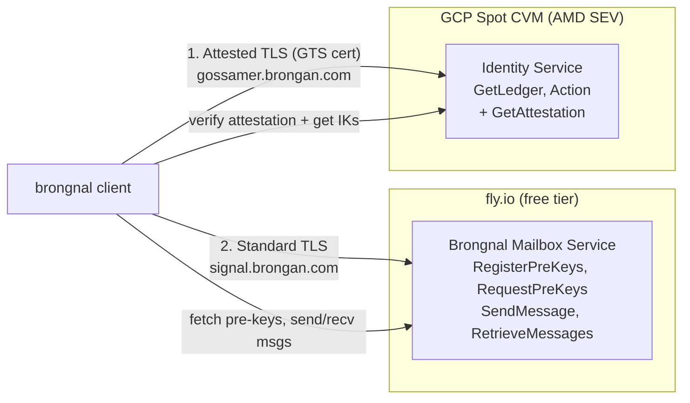
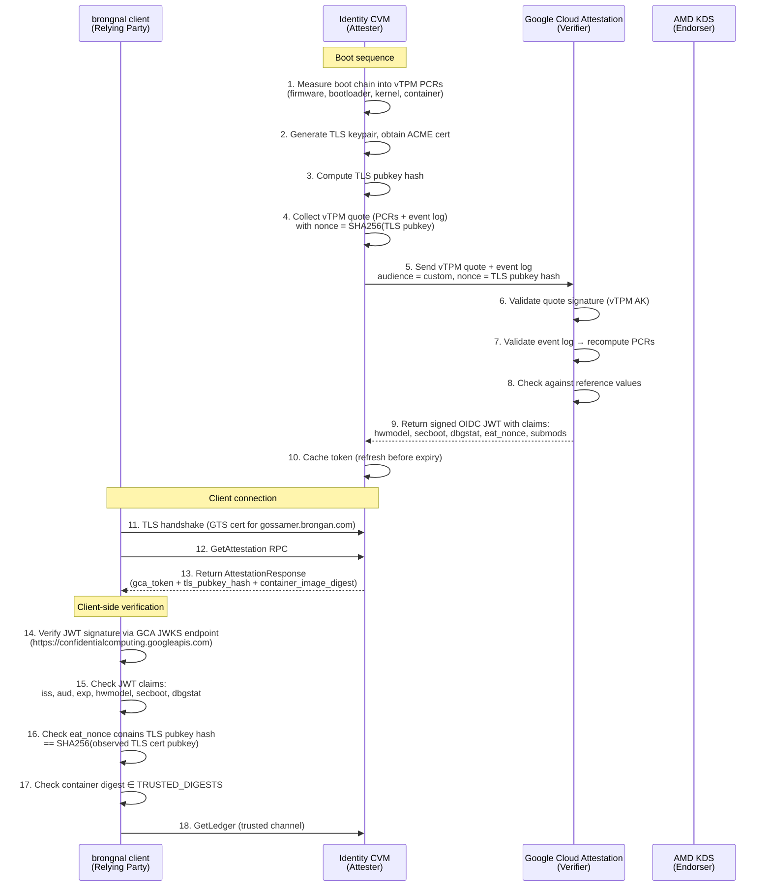

# Brongnal Roadmap: Confidential Computing & Split Architecture

This section tracks the migration of the Brongnal backend to a Confidential Computing environment and the separation of the Identity (Gossamer) and Mailbox services.

---

# Implementation Plan: Confidential Computing

## Threat Model & Architecture

The core goal is to protect `GetLedger` — resolving a username to its Ed25519 identity key. This is the only point where a malicious server can enable a MITM attack.

### Split Architecture



### Trust Chain (GCA Background Check Model)
1. **AMD SEV Silicon**: Memory encryption.
2. **Google vTPM**: Boot measurements (PCRs).
3. **Launcher**: Measures container image into PCR[14].
4. **GCA (Google Cloud Attestation)**: Validates vTPM evidence, returns a signed OIDC JWT.
5. **aTLS Binding**: TLS public key hash is embedded in the JWT's `eat_nonce`.
6. **Client**: Verifies JWT signature, claims, TLS binding, and container digest.

### Hybrid Background Check Flow




---

# Low-Level Task List

This list is designed for granular execution.

## M4: Service Split & Integration (IN PROGRESS)

### Phase 1: Decoupling the Server Binary
- [ ] **Audit `native/server/src/main.rs`**
    - [ ] Locate the gRPC server initialization block.
    - [ ] Remove `GossamerServiceServer` from the router.
    - [ ] Remove any local `InMemoryGossamer` state initialization.
    - [ ] Remove `gossamer` module imports from `server/src/lib.rs` or `main.rs`.
- [ ] **Update CLI Flags**
    - [ ] Ensure the server no longer requires a database path for Gossamer if it doesn't need to check identity (it currently doesn't, though it will in the future).
- [ ] **Shared State Refactor**
    - [ ] If `InMemoryGossamer` or its traits are needed by both `identity` and `client` (for tests), move them to `native/protocol` or a new `native/gossamer-core` crate.

### Phase 2: Integration Testing with Split Services
- [ ] **Refactor Integration Tests (`native/server/tests/`)**
    - [ ] Create a helper that spawns both the `identity` service and the `server` service on different ports (e.g., 50052 and 50051).
    - [ ] Update the test `User` initialization:
        ```rust
        let identity_addr = "http://[::1]:50052";
        let mailbox_addr = "http://[::1]:50051";
        User::new(identity_addr, mailbox_addr).await;
        ```
- [ ] **Verify Authentication Flow**
    - [ ] Register a user via the identity service.
    - [ ] Send a message via the mailbox service.
    - [ ] Verify that the client correctly looks up the receiver's IK from the *identity* service before sending to the *mailbox* service.

---

## M5: Infrastructure & Hardening (TODO)

### 1. Terraform Infrastructure (`infra/`)
- [ ] **Compute Configuration**
    - [ ] Define `google_compute_instance "brongnal-identity"`.
    - [ ] Set `machine_type = "n2d-standard-2"` (required for SEV).
    - [ ] Enable `confidential_instance_config { enable_confidential_compute = true }`.
    - [ ] Enable `shielded_instance_config` with `enable_secure_boot`, `enable_vtpm`, and `enable_integrity_monitoring`.
- [ ] **Disk & Security**
    - [ ] Create a `google_compute_disk` with CMEK encryption.
    - [ ] Attach it as a data disk at `/dev/sdb`.
- [ ] **Network & DNS**
    - [ ] Reserve a static external IP.
    - [ ] Create Cloud DNS records for `gossamer.brongan.com`.
    - [ ] Define `google_compute_firewall` to block all ports except **443** (Inbound).

### 2. COS Hardening Script (`infra/hardening.sh`)
- [ ] Write a script to be used as `user-data` or `cloud-init`:
    - [ ] Set `sysctl -w net.ipv4.ip_forward=0`.
    - [ ] Mount the data disk (SQLite location) with `noexec, nosuid, nodev`.
    - [ ] Block SSH access (metadata `enable-oslogin=FALSE`).
    - [ ] Ensure the container runs as a non-privileged user (UID 1000).

### 3. Container Image Building
- [ ] **Nix Flake Update**
    - [ ] Create a `dockerImage` target for the `identity` binary.
    - [ ] Use a minimal base (like `gcr.io/distroless/cc-debian12`).
    - [ ] Ensure the binary is statically linked or includes all necessary libs.

---

## M6: Deployment & Verification (TODO)

### 1. First Boot & ACME
- [ ] Deploy via Terraform.
- [ ] Monitor logs for the `launcher` binary.
- [ ] Verify `launcher` successfully:
    - [ ] Performs DNS-01 challenge via Cloud DNS API.
    - [ ] Obtains a GTS certificate.
    - [ ] Obtains a GCA OIDC token from `confidentialcomputing.googleapis.com`.

### 2. Trust Validation
- [ ] **Record Container Digest**
    - [ ] Get the final SHA-256 of the `identity` container image.
    - [ ] Update `native/client/src/trusted_digests.rs` with this digest.
- [ ] **End-to-End Client Test**
    - [ ] Connect client to `https://gossamer.brongan.com`.
    - [ ] Verify `GetAttestation` is called automatically during gRPC channel creation.
    - [ ] Ensure the client validates the JWT signature and the `eat_nonce` matches the TLS cert.

---

## Technical Details for Execution

### Identity Service Schema
On the CVM at `/mnt/data/gossamer.db`:
```sql
CREATE TABLE gossamer_ledger (
    provider BLOB NOT NULL,
    public_key BLOB NOT NULL,
    PRIMARY KEY (provider, public_key)
);
CREATE TABLE gossamer_messages (
    id INTEGER PRIMARY KEY AUTOINCREMENT,
    signed_message BLOB NOT NULL
);
```

### GCA Token Claims to Verify
- `iss`: `https://confidentialcomputing.googleapis.com`
- `hwmodel`: `GCP_AMD_SEV`
- `secboot`: `true`
- `dbgstat`: `disabled-since-boot`
- `eat_nonce`: `SHA256(Handshake_TLS_Cert_DER)`

---

# Legacy Issues & Future Work

The following issues were tracked in the previous version of the roadmap and are preserved for future consideration.

# Issue #49: Move App State into rust

https://rinf.cunarist.com/introduction/

---

# Issue #48: Read Receipts

Read receipts would be cool.

---

# Issue #47: Group Notifications

https://pub.dev/packages/flutter_local_notifications#grouping-notifications
The current implementation has all messages with a unique ID on a single channel.
There should be one group for DMs and separate groups for group chats. 

In order to successfully group notifications, the client must keep state about what messages are in a group. Only the last message? in a group gets `setAsGroupSummary = true` and includes summarizing information about the group. It is not individually displayed.

---

# Issue #46: Registration API returns remaining prekey count


---

# Issue #45: Signal Multi-device Support

Each linked device in multi-device treats each other as a different recipient. Encrypted messages are kept on server until they are received by the recipients. For each linked device, the server holds a queue of 1000 most recent undelivered messages so the device has to come online often enough to prevent overflowing of queue. The server also deletes undelivered messages that are older than 60 days even if the queue is not full.

---

# Issue #44: Ciphertext is a proto

The rust and flutter clients send UTF-8 encoded encrypted messages. This doesn't scale.

A proto should be created that allows for:
* Text
* Read receipts
* Images
* Other arbitrary communications at this protocol level

---

# Issue #43: Flutter Screen Size / DPI Scaling

Android on the left is cursed. Linux on the right looks great. This is suboptimal


---

# Issue #42: Add Push notifications

* Android? 
* Linux??
* How does this work with Rust?
* Server can use this to send notification?? https://docs.rs/fcm/latest/fcm/

---

# Issue #41: Avoid creating 100 pre keys and registration on every startup.

Current Behavior:
* On startup, a client generates 100 one time prekeys and registers them with the server.

Ideal Behavior:
* On startup, a client ensures they have 100 unused one time prekeys registered with the server.

There is no existing API to ask the server about this. A client can infer by querying their local storage.

---

# Issue #39: Add server crash reporting

idk sentry or something

---

# Issue #38: Use a logging framework

It would be very cool to export logs to flutter. Until then, the [log crate](https://crates.io/crates/log) is probably better than random `println!` and `eprintln!` everywhere.

On a second thought `tracing` might make more sense copying [fasterthanli.me](https://fasterthanli.me/series/building-a-rust-service-with-nix/part-4#using-git-crypt-to-encrypt-secrets)

---

# Issue #36: Handle network disconnections on the flutter app gracefully

Async tasks on the flutter app will fail if the app loses network connection. These should be restarted or something?
Startup is also borked if it cannot connect to the address.

---

# Issue #35: Add admin power to wipe database


---

# Issue #28: Handle a missing one-time prekey

Currently, if a client receives a message containing a one-time prekey not present in it's store, the client exits ungracefully. This is less than ideal.

---

# Issue #27: Implement signed pre key rotation

The forward secrecy properties of X3DH depend on a given client's signed pre key being rotated on some regular interval. The persistence layer of the backend already supports this functionality. This should be either added to the registration RPC or a separate RPC should be created for this purpose.

---

# Issue #26: Prevent one time key pop abuse

There are currently no restrictions on who or how many times a user can request to pop another user's one time keys. This is not ideal as it degrades forward secrecy. 

---

# Issue #25: Return error when attempting to overwrite registration

The current behavior is that when another identity key registers with a username, that previous registration is overwritten. Once the server is able to persist users and pending messages, this should be removed.

---

# Issue #24: Client Sqlite Async

Currently, Sqlite calls in the client are blocking calls done in async functions. Aysnc functions in rust SHOULD not block. [client/src/lib.rs](https://github.com/brongan/brongnal/blob/30939c52a5a65f32534c848dc42864dc8880471d/native/client/src/lib.rs#L130). Some viable options:

1. ```tokio::task::spawn_blocking```
2. Message passing with ```Sender``` and ```Receiver``` with a the sqlite call running on a separate thread.
3. Find a new library to make the calls async. r2d2?

Related research
1. https://www.reddit.com/r/rust/comments/bj0s3k/problem_with_rusqlite_and_r2d2/
2. https://www.reddit.com/r/rust/comments/g1k10v/database_is_locked_error_with_actix_diesel_r2d2/
3. https://www.reddit.com/r/rust/comments/nle9ip/r2d2s_pool_cannot_copy_so_how_can_i_link_the/

---

# Issue #23: Use tokio_stream for the stream of decrypted messages from rust to flutter

The current implementation returns a ```Result<()>``` and takes an output parameter of ```Sender<DecryptedMessage>```. Really, a stream should be returned.

[client/src/lib.rs](https://github.com/brongan/brongnal/blob/30939c52a5a65f32534c848dc42864dc8880471d/native/client/src/lib.rs#L130)

[tokio_stream](https://docs.rs/tokio-stream/latest/tokio_stream/)

---

# Issue #20: Use some sort of secure storage for (at least) identity key

[flutter_secure_storage](https://pub.dev/packages/flutter_secure_storage) maybe?

---

# Issue #19: Gracefully handle attempts to message yourself

Should the server allow this?

---

# Issue #17: Client persists message history

It'd be great if your chat history wasn't reset every time you reopened the app :)

---

# Issue #16: Use rustls_platform_verifier

Platform specific verifier is best :)

---

# Issue #15: Validate sender identity

I should have some sorta key transparency or PKI or pinning so the client doesn't just trust the decrypted sender identity.

---

# Issue #14: RetrieveMessages requires proof of possession

Other users shouldn't be able to drain a user's pending messages :)

---

# Issue #13: GetMessages is a Streaming RPC

It'd be pretty cool for the TUI to stream received messages instead of requiring an explicit call to "get_messages".

---

# Issue #12: README

Would love to have a README explaining project description (with a screenshot) and basic setup instructions

---

# Issue #11: Client persists Identity

thanks @dandersen

---

# Issue #10: Bump symmetric encryption scheme and change ciphertext to binary format.

Since we're not using JSON, there's no point in making ciphertexts web safe.

---

# Issue #8: Terminate TLS

fly.io cannot be trusted

---

# Issue #7: Implement Ratcheting

A lack of ratcheting results in [catastrophic key reuse problems](https://signal.org/docs/specifications/x3dh/)

Need to implement [double ratcheting](https://signal.org/docs/specifications/doubleratchet)

---

# Issue #6: Switch server framework to GRPC

In order to switch to an Android client, a language agnostic RPC framework needs to be used. Rather than rolling my own over TCP. Let's just use gRPC.

---

# Issue #5: Reuse Session Keys

Performing an entire X3DH key exchange on every message isn't the greatest. Session keys can be reused until a client decides to ratchet.

https://soatok.blog/2020/11/14/going-bark-a-furrys-guide-to-end-to-end-encryption

---

# Issue #4: Create Android Client

As cool as a TUI client is, if this is actually going to be usable by anyone, an Android client is necessary.

I want to use the most modern stack possible with [Jetpack Compose](https://developer.android.com/develop/ui/compose) and [Room](https://developer.android.com/training/data-storage/room)

---

# Issue #3: Server persists state

Currently the server only stores identities and messages in memory and resets on updates.
This should be persisted in a SQLite database at first. SQLite is already accessible in the nix build attaching a fly.io volume is easy.

Later Turso should be investigated.

---

# Issue #2: TUI Client

A simple TUI client will increase iteration speed on the server.

[Good Example](https://github.com/ProgrammingRust/async-chat/blob/master/src/bin/client.rs)

---

# Issue #1: Gossamer

This is blocked on persisting identities in clients and server.

Currently registration associates a name with an identity key. Reregristration overwrites a previous one.

https://soatok.blog/2020/11/14/going-bark-a-furrys-guide-to-end-to-end-encryption/


---
